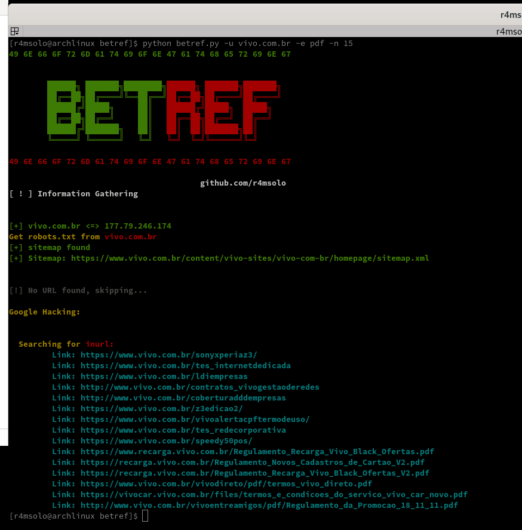
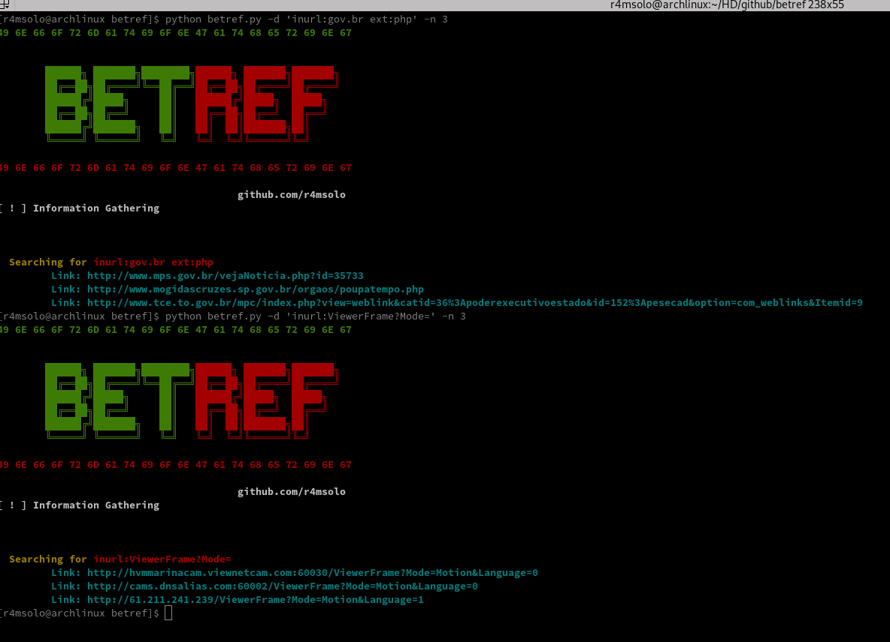
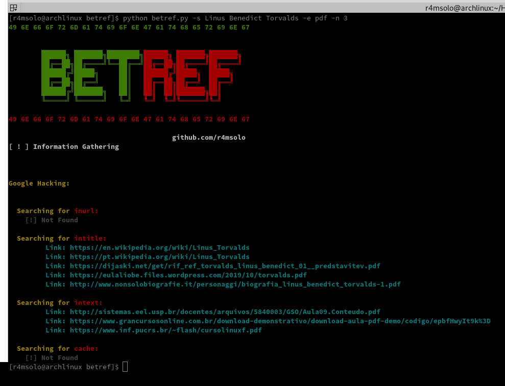

# betref
[Information Gathering]

```
  $ pip install -r requirements.txt --user && chmod +x betref.py
```
```
  $ ./betref.py [ARGS]
```
```
ARGS:
-s automated and exact search by name or phrase passed as an argument
-u search within a given address
-e Search for extensions ex: -e pdf
-n Number of searchs ex: -n 5
-d Manual search
-o save search to file ex: -o dork.txt
```
 
 
 
 
  


## License

MIT © [Igor M. Martins](https://igor-m-martins.github.io)<br/>
